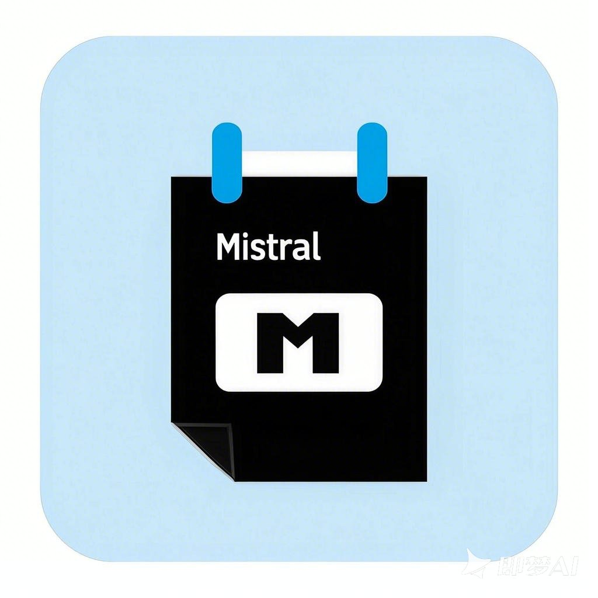
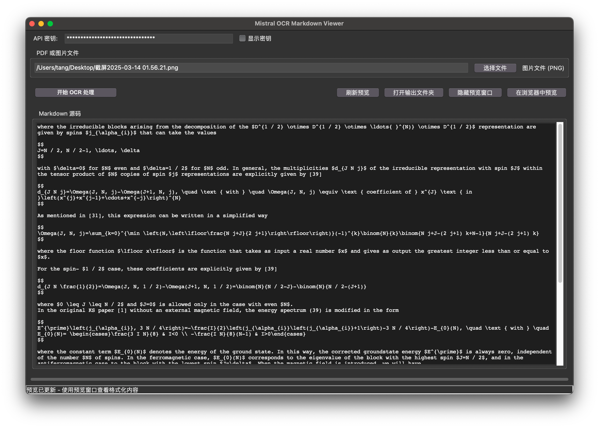
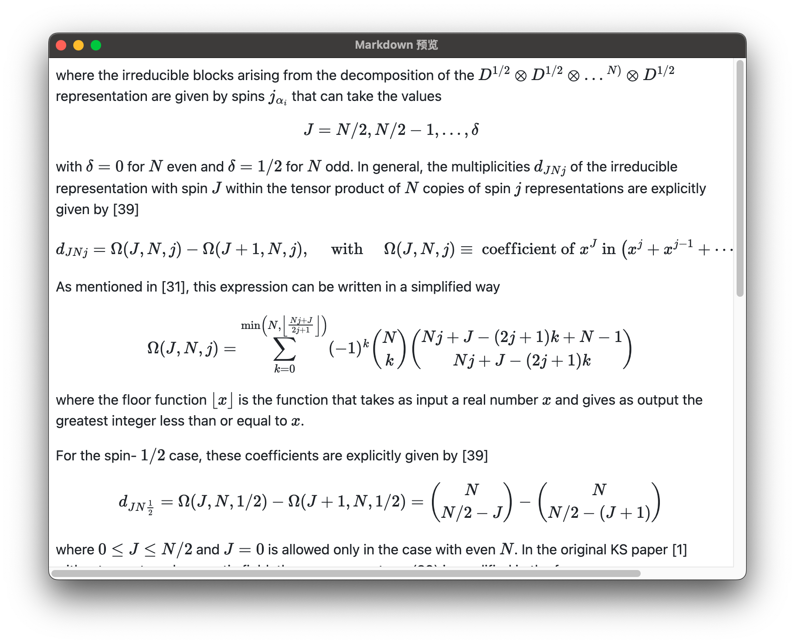

# Mistral OCR Markdown Viewer

一个基于 Mistral API 的 OCR 工具，支持 PDF 和图片文件的文字识别，并提供 Markdown 格式的预览功能

<div style="text-align: center;">
  
</div>

> LOGO is made by Doubao Seedream 2.0 ([即梦](https://jimeng.jianying.com))

## 功能特性

- 支持 PDF 和多种图片格式（JPG, JPEG, PNG 等）
- 自动将图片文件转换为 PDF 后进行 OCR 处理
- 使用 [Mistral API](https://mistral.ai/news/mistral-ocr) 提供高质量的 OCR 识别结果
- Markdown 格式输出，支持表格和数学公式渲染等
- 提供内嵌预览窗口

## 工作流程

1. 根据输入文件类型（PDF 或图片）进行预处理，如果是图片，会自动转换为 PDF
2. 调用 Mistral API 进行 OCR 识别，获取 OCR 结果
3. `Python Markdown` 与 `md4mathjax`、`extra` 拓展将识别的内容整理为 Markdown 格式，并生成预览所需的 HTML
4. 识别结果导出至 `outputs` 文件夹

## 页面设计

- 使用 `Tkinter` 作为主要的图形界面框架

- 为了提供更丰富的预览效果，集成 `PyQt5`，利用 `QWebEngineView` 显示 HTML 格式的预览内容

## 安装步骤

### 1. 克隆项目

```bash
git clone https://github.com/Word2VecT/MistralOCR
cd MistralOCR
```

### 2. 安装依赖

本项目使用 `uv` 进行依赖管理，确保你已安装 [uv](https://github.com/astral-sh/uv)

在 MacOS 上推荐使用 [Homebrew](https://brew.sh) 安装，在 Windows 上推荐使用 [Scoop](https://scoop.sh)

创建初始虚拟环境：

```bash
uv venv
```

按照提示启动虚拟环境后安装依赖：

```bash
uv pip install -r pyproject.toml
```

### 3. 配置 API 密钥

你可以通过环境变量或程序界面设置 API 密钥：

```bash
echo 'export MISTRAL_API_KEY="你的API密钥"' >> ~/.bashrc   # For Bash
echo 'export MISTRAL_API_KEY="你的API密钥"' >> ~/.zshrc    # For Zsh
set -Ux MISTRAL_API_KEY "你的API密钥"                        # For Fish
Setx MISTRAL_API_KEY "你的API密钥"                          # For PowerShell
```

然后重启终端

或在程序界面中输入密钥

## 运行程序

首先需要启动虚拟环境

### 图形界面模式（推荐）

直接运行程序：

```bash
uv run main.py
```

### 命令行模式

```bash
uv run main.py [--api-key 你的API密钥] 文件路径1 [文件路径2 ...]
```

例如：

```bash
uv run main.py [--api-key your_api_key_here] example.pdf image.png
```

## 项目结构

```
mistral_ocr/
├── main.py                 # 主程序入口
├── outputs/                # OCR 处理结果输出目录
├── requirements.txt        # 项目依赖列表
└── README.md               # 项目说明文档
```

## 注意事项

- 确保你的网络环境可以访问 Mistral API
- OCR 处理速度取决于文件大小和网络状况，请耐心等待处理完成

## 效果展示




## 作者

- Zinan Tang

## 致谢

- [Mistral AI](https://mistral.ai)

## 许可证

本项目采用 Apache-2.0 许可证，详情请参阅 [LICENSE](LICENSE) 文件
